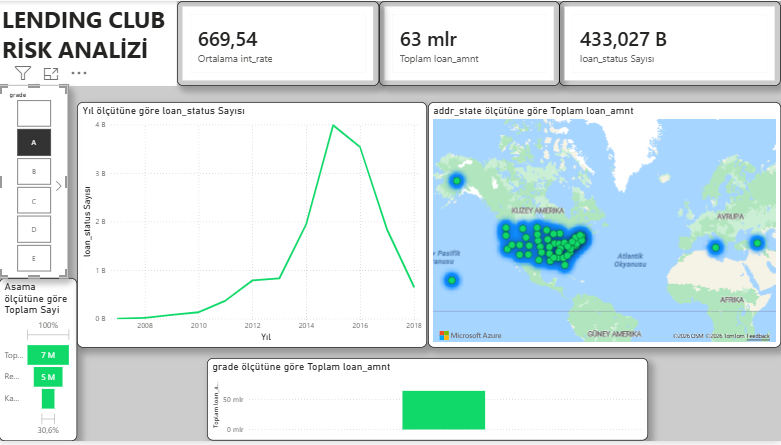

# Lending Club Credit Risk Analysis Project 📊

##  Proje Özeti
Bu proje, Lending Club'ın 2007-2018 yılları arasındaki **2.2 Milyon satırlık** kredi verisini analiz ederek risk faktörlerini belirlemek ve karar destek mekanizması oluşturmak amacıyla yapılmıştır.

## 🖼️ Dashboard Önizleme

## Kullanılan Teknolojiler
* **Python (Pandas):** 1.5 GB'lık ham verinin temizlenmesi (Data Cleaning), eksik verilerin yönetimi ve ETL süreçleri.
* **Power BI:** Verilerin görselleştirilmesi, DAX hesaplamaları ve interaktif dashboard tasarımı.

##  Temel Çıkarımlar
1.  **Risk/Hacim İlişkisi:** Kredi hacminin en yüksek olduğu B ve C segmentlerinde risk yönetilebilir seviyededir.
2.  **Dönemsel Trend:** 2015-2016 yıllarındaki agresif kredi büyümesi, batık oranlarında (Charged Off) artışa neden olmuştur.
3.  **Coğrafi Analiz:** Risk belirli eyaletlerde (CA, TX, NY) yoğunlaşmıştır.

---
*Bu proje portföy çalışması olarak hazırlanmıştır.*
